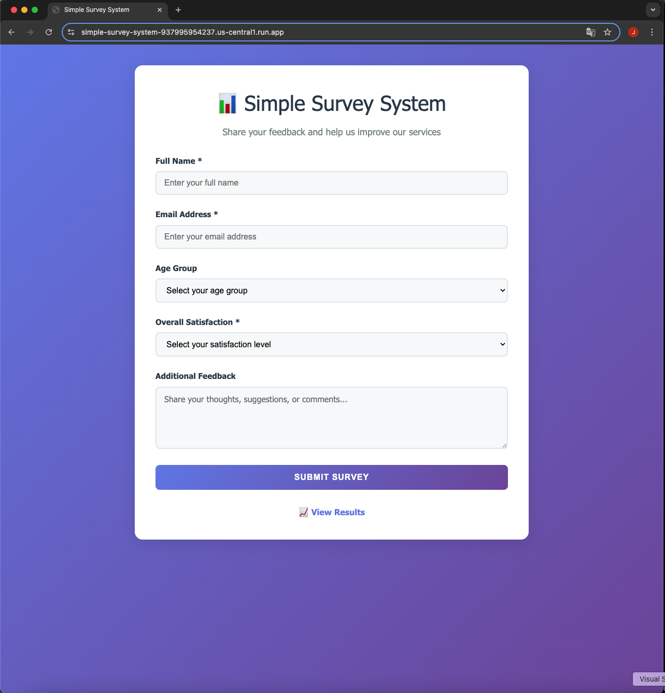
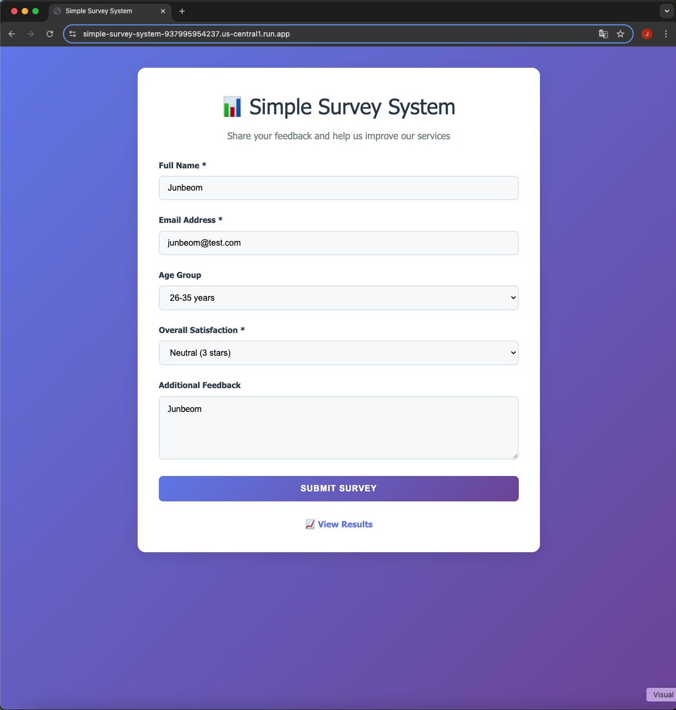
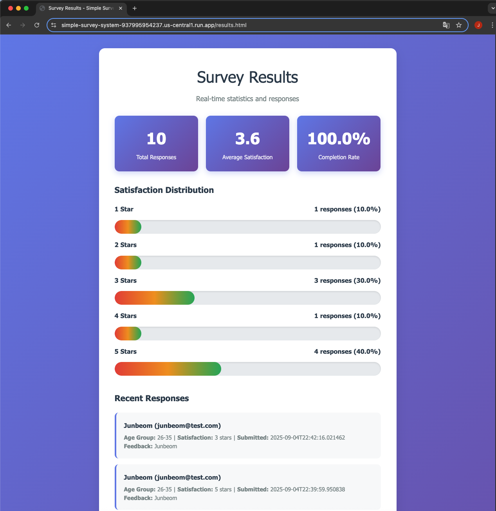

# Simple Survey System on GCP

A lightweight survey system built on Google Cloud Platform using Cloud Run and Firestore, optimized for free tier usage.

## 🚀 Features

- **Survey Submission**: Web form for collecting survey responses
- **Data Storage**: Firestore NoSQL database integration
- **Real-time Results**: Live statistics and response visualization
- **Free Tier Optimized**: Designed to stay within GCP Always Free limits
- **Modern UI**: Responsive design with beautiful gradients and animations

## 📸 Screenshots

### Survey Form


### Survey Form with Data Input


### Survey Results Dashboard


## 🏗️ Architecture

```
┌─────────────────┐    ┌─────────────────┐    ┌─────────────────┐
│   Frontend      │───▶│   Backend       │───▶│    Firestore    │
│   (HTML/CSS/JS) │    │   (Flask API)   │    │   (NoSQL DB)    │
└─────────────────┘    └─────────────────┘    └─────────────────┘
```

## 📊 Free Tier Limits

### Cloud Run
- **Requests**: 2 million requests per month (Always Free)
- **CPU**: 1 vCPU
- **Memory**: 512MB
- **Region**: us-central1

### Firestore
- **Storage**: 1GB (Always Free)
- **Reads/Writes**: 50,000 per month (Always Free)
- **Region**: us-central1

## 🛠️ Tech Stack

- **Backend**: Python Flask with REST API
- **Frontend**: HTML5, CSS3, Vanilla JavaScript
- **Database**: Google Cloud Firestore
- **Container**: Docker
- **Platform**: Google Cloud Run
- **Infrastructure**: Terraform (optional)

## 📁 Project Structure

```
junbeom-sre-gcp-project/
│
├── backend/                # Flask API (survey response storage, results retrieval)
│   ├── app.py               # Main Flask application
│   └── firestore_service.py # Firestore integration logic
│
├── frontend/               # Simple web forms
│   ├── index.html           # Survey input form
│   ├── results.html         # Aggregated results page
│   ├── css/
│   │   └── style.css
│   └── js/
│       └── app.js
│
├── docs/                   # Documentation and screenshots
│   └── screenshots/         # Application screenshots
│
├── infra/                  # Optional (Terraform IaC)
│   └── main.tf              # Cloud Run + Firestore resource definitions
│
├── Dockerfile              # Cloud Run deployment (root level)
├── requirements.txt        # Python packages (root level)
├── deploy-free-tier.sh     # Free tier deployment script
└── README.md               # Project documentation
```

## 🚀 Quick Start

### Prerequisites

- Google Cloud Platform account
- Google Cloud CLI installed
- Docker installed
- Python 3.11+

### 1. GCP Project Setup

```bash
# Login to GCP CLI
gcloud auth login

# Set project
gcloud config set project YOUR_PROJECT_ID

# Enable required APIs
gcloud services enable run.googleapis.com
gcloud services enable firestore.googleapis.com
gcloud services enable containerregistry.googleapis.com
```

### 2. Local Testing

```bash
# Install backend dependencies
cd backend
pip install -r requirements.txt

# Run backend locally
python app.py

# Open frontend in browser
# Navigate to http://localhost:8080
```

### 3. Deployment

#### Option 1: Free Tier Deployment (Recommended)

```bash
# Clone the repository
git clone https://github.com/jaylim/junbeom-sre-gcp-project.git
cd junbeom-sre-gcp-project

# Update PROJECT_ID in deploy-free-tier.sh (already configured)
# PROJECT_ID="shaped-canyon-470500-d9"

# Run deployment (no local Docker required)
chmod +x deploy-free-tier.sh
./deploy-free-tier.sh
```

#### Option 2: Manual Deployment

```bash
# Set project and region
gcloud config set project YOUR_PROJECT_ID
gcloud config set run/region us-central1

# Enable APIs
gcloud services enable run.googleapis.com
gcloud services enable firestore.googleapis.com
gcloud services enable cloudbuild.googleapis.com

# Build and deploy
gcloud builds submit --tag gcr.io/YOUR_PROJECT_ID/simple-survey-system .
gcloud run deploy simple-survey-system \
  --image gcr.io/YOUR_PROJECT_ID/simple-survey-system \
  --allow-unauthenticated \
  --region us-central1 \
  --memory 512Mi \
  --cpu 1 \
  --max-instances 10 \
  --min-instances 0
```

#### Option 2: Terraform Deployment

```bash
cd infra

# Create variables file
cp terraform.tfvars.example terraform.tfvars
# Edit terraform.tfvars with your project_id

# Initialize and deploy
terraform init
terraform plan
terraform apply
```

### 4. Firestore Database Setup

Create Firestore database manually in GCP Console:

```bash
# Manual setup in GCP Console:
# - Go to Firestore → Create database
# - Select 'Native mode'
# - Choose 'us-central1' region (Always Free)
# - Disable delete protection (for free tier)
```

### 5. Free Tier Checklist

✅ **Region Settings**
- Cloud Run: us-central1
- Firestore: us-central1

✅ **Cloud Run Configuration**
- Memory: 512Mi
- CPU: 1 vCPU
- Max instances: 10
- Min instances: 0 (prevents idle charges)
- Concurrency: 80

✅ **Required APIs**
- Cloud Run Admin API
- Cloud Build API
- Firestore API
- Artifact Registry API

✅ **IAM Permissions**
- Cloud Run service account needs `roles/datastore.user`

## 🔧 Environment Variables

| Variable | Description | Default |
|----------|-------------|---------|
| `GOOGLE_CLOUD_PROJECT` | GCP Project ID | - |
| `PORT` | Application port | 8080 |

## 📈 Monitoring & Cost Management

### Cost Monitoring
- GCP Console > Billing for usage tracking
- Cloud Run metrics monitoring
- Firestore usage tracking

### Free Tier Optimization Tips
1. **Cloud Run**: Limit max instances (10)
2. **Firestore**: Optimize read/write operations
3. **Image Size**: Minimize Docker image size
4. **Region**: Use us-central1 (free tier optimized)

## 🧪 Testing

### API Endpoints

```bash
# Health check
curl https://simple-survey-system-937995954237.us-central1.run.app/health

# Submit survey (POST)
curl -X POST https://simple-survey-system-937995954237.us-central1.run.app/api/submit-survey \
  -H "Content-Type: application/json" \
  -d '{"name":"Test User","email":"test@example.com","satisfaction":"5"}'

# Get results
curl https://simple-survey-system-937995954237.us-central1.run.app/api/survey-results
```

### Live Demo

🌐 **Live Application**: https://simple-survey-system-937995954237.us-central1.run.app/

- **Survey Form**: https://simple-survey-system-937995954237.us-central1.run.app/
- **Results Page**: https://simple-survey-system-937995954237.us-central1.run.app/results

### Local Testing

```bash
# Build Docker image (from root directory)
docker build -t simple-survey-system .

# Run locally
docker run -p 8080:8080 simple-survey-system
```

## 🔒 Security Considerations

- **Authentication**: Currently public access (development use)
- **Data Validation**: Server-side input validation
- **CORS**: Configured for frontend integration
- **Rate Limiting**: Recommended for production

## 🚨 Troubleshooting

### Common Issues

1. **Firestore Connection Error**
   - Check service account permissions
   - Verify project ID configuration
   - Ensure Firestore database is created in us-central1 region

2. **Cloud Run Deployment Failure**
   - Verify Docker image build
   - Check memory/CPU limits
   - Ensure Dockerfile is in root directory

3. **Free Tier Exceeded**
   - Monitor usage in GCP Console
   - Set resource limits
   - Check billing alerts

4. **Build Context Issues**
   - Ensure Dockerfile is in root directory
   - Verify all required files (requirements.txt, backend/, frontend/) are present
   - Use `gcloud builds submit` without `-f` flag for this Cloud Shell version

## 📝 License

MIT License

## 🤝 Contributing

1. Fork the repository
2. Create your feature branch
3. Commit your changes
4. Push to the branch
5. Create a Pull Request

## 📞 Support

For issues and questions, please use GitHub Issues.